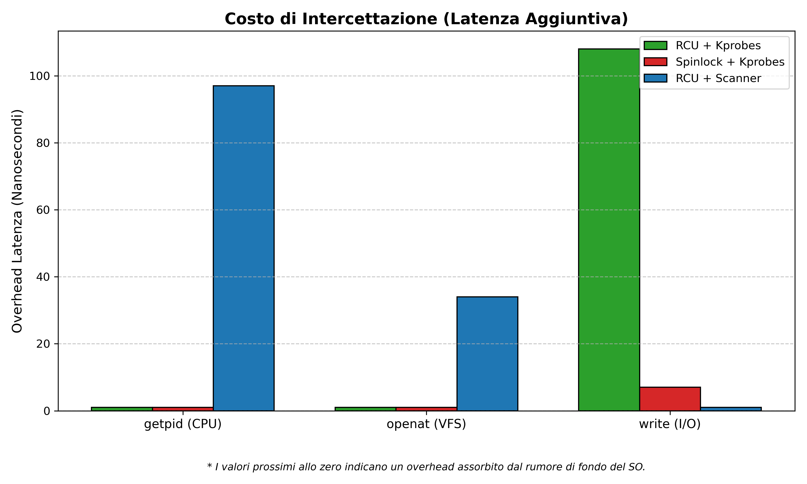
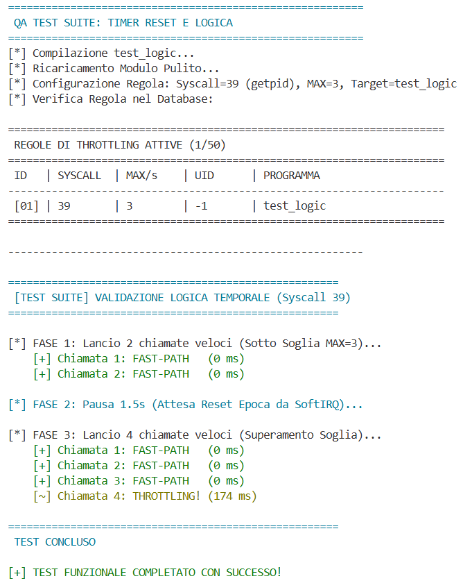
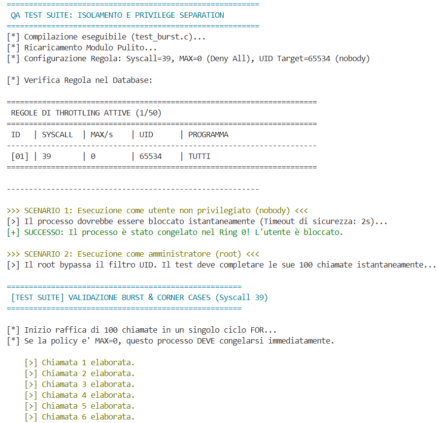
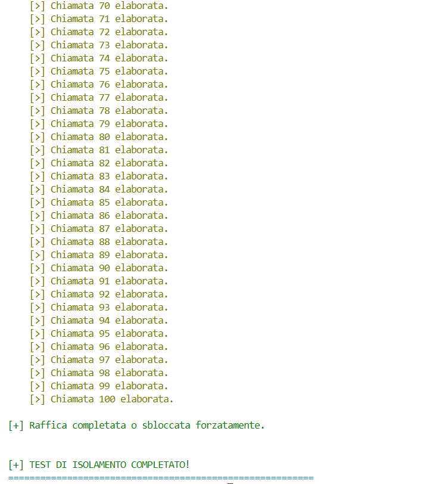
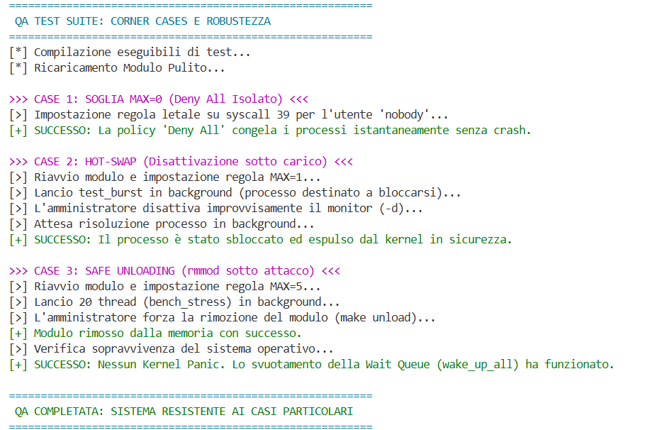

# Syscall Throttling - Advanced Operating Systems

**Autore:** Dennis Mariani 
**Corso:** Sistemi Operativi Avanzati (A.A. 2025/2026)  

---

## Indice
1. [Descrizione del Progetto](#descrizione-del-progetto)
2. [Architettura del Sottosistema](#architettura-del-sottosistema)
3. [Mitigazione del Thundering Herd](#mitigazione-del-thundering-herd)
4. [Struttura del Repository](#struttura-del-repository)
5. [Modalità di Compilazione e Design Pattern](#modalità-di-compilazione-e-design-pattern)
6. [Utilizzo e Configurazione (CLI Tool)](#utilizzo-e-configurazione-cli-tool)
7. [Analisi delle Prestazioni (Benchmark)](#analisi-delle-prestazioni-benchmark)
8. [Test di Validazione](#test-di-validazione)
9. [Debugging e Log del Kernel](#debugging-e-log-del-kernel)

---

## 1. Descrizione del Progetto

Questo repository contiene l'implementazione di un Modulo Kernel Linux (LKM) x86-64 progettato per agire come un *Reference Monitor* per le chiamate di sistema (System Call Throttling). 

Il modulo permette di intercettare e limitare dinamicamente la frequenza di invocazione di specifiche syscall in base a:
- **Nome dell'eseguibile** (Program Name `comm`)
- **Identificativo dell'utente** (Effective User ID)

Se il volume di chiamate supera una soglia massima (`MAX`) configurabile, all'interno di una finestra temporale di 1 secondo (dettata dal timer hardware `HZ`), i thread invocanti vengono temporaneamente sospesi (throttling) per mitigare abusi o comportamenti anomali, garantendo al contempo la fluidità e la stabilità dell'intero sistema operativo.

## 2. Architettura del Sottosistema

Il progetto è diviso in due macro-componenti:

- **Kernel Space (Ring 0) - Intercettore:** Il motore principale implementa l'hooking della `sys_call_table`. Disabilitando temporaneamente le protezioni hardware (bit WP del registro CR0) o sfruttando tecniche avanzate di Dispatcher Override per kernel recenti (>= 5.15), il modulo devia il flusso di esecuzione verso i propri wrapper. 
- **User Space (Ring 3) - CLI Tool:** Un tool di amministrazione C che comunica con il kernel tramite un Character Device (`/dev/syscall_defender`) sfruttando comandi `ioctl` per l'inserimento, la rimozione e il monitoraggio delle policy a runtime in totale sicurezza.
- **Motore di Throttling:** Utilizza un Kernel Timer asincrono in contesto Softirq per la gestione delle epoche temporali. Per evitare crolli di prestazioni sotto stress (problema del *Thundering Herd*), i thread sospesi vengono inseriti in Wait Queue private e gestiti tramite una coda **FIFO Strict**, garantendo un numero di *Context Switches* minimo e un rispetto della soglia MAX.

---

## 3. Mitigazione del Thundering Herd

A differenza dei classici approcci in cui il demone temporale risveglia simultaneamente tutti i thread bloccati, causando un picco di context-switches e spreco di CPU a causa della **lock contention** per ottenere i pochi gettoni disponibili, questo modulo implementa una **Wait Queue Selettiva (FIFO Strict)**.

Allo scoccare del tick `HZ`, il Kernel Timer asincrono in contesto Softirq ispeziona la coda e risveglia unicamente i thread che rientrano nel nuovo budget (`MAX`), lasciando gli altri bloccati (`TASK_INTERRUPTIBLE`). Questo design garantisce che il numero di **Context Switches** sia limitato, azzerando l'overhead di CPU sprecata e prevenendo il collasso dello scheduler sotto stress estremo.

---

## 4. Struttura del Repository

- `kmod/`: Codice sorgente del Modulo Kernel (Ring 0).
- `userspace/`: Tool da riga di comando per l'amministrazione del Reference Monitor (Ring 3).
- `include/`: File header e API condivise tra User Space e Kernel Space.
- `test/`: Programmi C per benchmark e generazione di test particolari.
- `scripts/`: Script bash per automazioni di testing avanzato e stress-test.

---

## 5. Modalità di Compilazione e Design Pattern

L'ambiente di sviluppo e test è basato su **Ubuntu Server 22.04 LTS** (Kernel 5.15.x).

Per compilare il progetto sono necessari i pacchetti essenziali di build e gli header del kernel:

```bash
sudo apt update
sudo apt install build-essential linux-headers-$(uname -r)
```

Il modulo è stato realizzato per permettere l'abilitazione di differenti modalità (Sincronizzazione e Hacking della Syscall Table) a tempo di compilazione tramite appositi flag nel `Makefile`.

**Opzioni di Sincronizzazione (RCU vs Spinlock)**: Il motore del database interno (Ring 0) implementa due meccanismi per la sincronizzazione multi-core:
- **RCU (Default)**: Utilizza Read-Copy-Update, garantendo l'assenza di lock in lettura e massimizzando le prestazioni del Reference Monitor.
- **Spinlock**: Utilizza un lock globale serializzato in lettura/scrittura.

**Opzioni di Discovery della Syscall Table (Kprobes vs Scanner)**: L'intercettazione del flusso di esecuzione richiede la scoperta dinamica in memoria della `sys_call_table`. Il modulo offre due algoritmi:
- **Kprobes (Default)**: Metodo che sfrutta le API di debugging del kernel per risolvere dinamicamente i simboli oscurati.
- **Scanner**: Metodo brute-force che attraversa manualmente la gerarchia hardware della Memory Management Unit (MMU) — navigando tra le Page Tables (PML4, PUD, PMD, PTE) per evitare Page Fault fatali — scansionando la memoria alla ricerca di firme note (es. sys_ni_syscall).

Il sistema di build riconosce le variabili d'ambiente `SYNC` e `DISCOVERY`. Se non specificate, verranno utilizzati i default (`rcu` e `kprobes`). 

**Compilazione di default (RCU + Kprobes):**

```bash
make reload
```

**Compilazione variando solo l'algoritmo di Discovery (RCU + Scanner):**
```bash
DISCOVERY=scanner make reload
```
**Compilazione variando solo il modello di Sincronizzazione (Spinlock + Kprobes):**
```bash
SYNC=spinlock make reload
```

**Compilazione alterando entrambi i design pattern (Spinlock + Scanner):**
```bash
SYNC=spinlock DISCOVERY=scanner make reload
```

Per scaricare il modulo in sicurezza (attendendo l'uscita dei thread grazie al Safe Unloading), rimuovere il device node e pulire i file di compilazione utilizziamo il comando:

```bash
make unload
```

---

## 6. Utilizzo e Configurazione (CLI Tool)

L'interazione con il modulo Ring 0 avviene tramite un Character Device generato dinamicamente (`/dev/syscall_defender`) utilizzando la system call `ioctl`. In particolare, è stato sviluppato un tool C dedicato nello User Space (`userspace/cli_tool.c`) per l'amministrazione delle policy di throttling, l'estrazione delle statistiche e il controllo globale del motore di throttling (guidato da Kernel Timers in Softirq).

**Sicurezza (Effective UID):** Come richiesto dalle specifiche, l'accesso al device e la configurazione delle regole richiedono rigorosamente i privilegi di amministratore. Il modulo verifica le credenziali del chiamante (`current_euid()`). Qualsiasi tentativo di accesso da parte di utenti non privilegiati verrà intercettato e respinto con errore `-EPERM` (Operation not permitted).

Per compilare il pannello di controllo utente si usa la seguente sequenza di comandi:

```bash
cd userspace
make
```
**1. Inserimento Regole di Throttling**
La sintassi del comando richiede privilegi di root e accetta parametri dinamici tramite flag:

```bash
sudo ./cli_tool -s <syscall_num> -m <max_calls> [-u <uid>] [-p <program>]
```

**Esempio:** Limitare la system call 2 (sys_open) a un massimo di 10 chiamate al secondo per l'utente con UID 1000:

```bash
sudo ./cli_tool -s 2 -m 10 -u 1000
```

**2. Estrazione Statistiche** 
Il modulo tiene traccia delle tempistiche di sospensione dei processi calcolando i cicli hardware della CPU tramite l'istruzione assembly rdtscp (superando il problema della migrazione della CPU).

Per estrarre il report statistico di una regola:

```bash
sudo ./cli_tool -g <syscall_num>
```

L'output mostrerà il picco di ritardo (in cicli di clock), l'identificativo della vittima (UID e Programma) e il numero massimo e medio di thread bloccati simultaneamente per quella syscall.

**3. Visualizzazione Regole Attive**
Il tool permette di interrogare in tempo reale il database in Ring 0 (tramite un'allocazione sicura sull'heap del kernel) per ottenere una tabella delle policy attualmente attive:

```bash
sudo ./cli_tool -l
```

**4. Interruttore Globale**
È possibile bypassare istantaneamente le regole di throttling senza dover disinstallare il modulo o cancellare le regole dalla RAM:

```bash
sudo ./cli_tool -d  # Disabilita il monitor
sudo ./cli_tool -e  # Riabilita il monitor
```

---

## 7. Analisi delle Prestazioni (Benchmark)

Un **Reference Monitor** in Ring 0 deve garantire la sicurezza del sistema senza degradarne le prestazioni generali. Per validare l'impatto architetturale del modulo, abbiamo sviluppato e condotto due distinte metodologie di stress-test

### 7.1 Metodologia di Test

1. **Test di Latenza Hardware (`test/bench_latency.c`):** 
    - **Obiettivo:** Misurare l'overhead puro introdotto dalla deviazione del flusso (Hook) e dalla lettura del database quando la syscall *non* viene bloccata (Fast-Path).
    - **Esecuzione:** Un singolo thread esegue 1.000.000 di chiamate consecutive in un ambiente privo di limiti. 
    - **Metrica:** Latenza in nanosecondi, misurata leggendo direttamente il Time-Stamp Counter della CPU (registro TSC tramite istruzione assembly `rdtscp`) per bypassare le imprecisioni dei clock software.

2. **Test di Concorrenza e Scheduling (`test/bench_stress.c`):**
   - **Obiettivo:** Misurare la stabilità del sistema operativo sotto un attacco DoS locale e l'efficienza della Wait Queue quando le syscall *vengono* bloccate (Slow-Path).
   - **Esecuzione:** 20 thread paralleli tentano di invocare simultaneamente la stessa syscall soggetta a una policy fortemente restrittiva (es. `MAX=5`).
   - **Metrica:** Cambi di contesto (*Context Switches*) misurati tramite il profiler hardware di Linux (`perf`).

### 7.2 Profilazione Overhead Base (Fast-Path)

Il seguente test mostra il costo computazionale dell'intercettore Ring 3 ➔ Ring 0 ➔ Ring 3.

| Syscall | Configurazione | Baseline (ns) | Bypass (ns) | Overhead (ns) |
| :--- | :--- | :--- | :--- | :--- |
| **getpid (39)** | RCU + Kprobes | 629 | 572 | 0 |
| **getpid (39)** | Spinlock + Kprobes | 512 | 483 | 0 |
| **getpid (39)** | RCU + Scanner | 472 | 569 | +97 |
| **openat (257)**| RCU + Kprobes | 3168 | 3026 | 0 |
| **openat (257)**| Spinlock + Kprobes | 3133 | 3037 | 0 |
| **openat (257)**| RCU + Scanner | 3007 | 3041 | +34 |
| **write (1)** | RCU + Kprobes | 668 | 776 | +108 |
| **write (1)** | Spinlock + Kprobes | 600 | 607 | +7 |
| **write (1)** | RCU + Scanner | 768 | 571 | +206 |



-  Nelle configurazioni basate su **Kprobes**, l'overhead aggiunto dall'hook è trascurabile. *NB*: La latenza è posta a zero nel caso sia negativa solo per questioni grafiche.
- Sebbene lo Spinlock mostri tempi di latenza paragonabili (ricordiamo che è un test a thread singolo), l'infrastruttura di produzione adotta **RCU (Read-Copy-Update)** per design. Essendo un ambiente Read-Mostly, RCU permette a un numero illimitato di thread concorrenti di attraversare il Fast-Path simultaneamente in modo *lock-free*. Uno Spinlock globale, al contrario, forzerebbe la serializzazione di tutte le system call su tutti i core CPU, generando un collo di bottiglia (*Lock Contention*) in produzione.
- L'approccio brute-force dello scanner di memoria introduce una minima penalità architetturale costante (es. +97ns su `getpid`), confermandosi un fallback comunque efficiente per kernel sprovvisti di moduli di debugging abilitati.

### 7.3 Mitigazione del Thundering Herd (Analisi Context Switches)

Il dato più critico della stabilità di un kernel non è il tempo speso a calcolare, ma il tempo sprecato a fare *Context Switching* sotto stress. I risultati di `perf` per lo stress-test a 20 thread in concomitanza con una regola restrittiva mostrano una buona stabilità:

| Syscall | Configurazione | Thread Attaccanti | Context Switches |
| :--- | :--- | :--- | :--- |
| **getpid (39)** | RCU + Kprobes | 20 | 206 |
| **getpid (39)** | Spinlock + Kprobes | 20 | 212 |
| **getpid (39)** | RCU + Scanner | 20 | 198 |
| **openat (257)**| RCU + Kprobes | 20 | 205 |
| **openat (257)**| Spinlock + Kprobes | 20 | 212 |
| **openat (257)**| RCU + Scanner | 20 | 214 |
| **write (1)** | RCU + Kprobes | 20 | 204 |
| **write (1)** | Spinlock + Kprobes | 20 | 213 |
| **write (1)** | RCU + Scanner | 20 | 206 |


**Perché esattamente ~200?** Questo numero certifica il successo dell'architettura e la risoluzione del problema del *Thundering Herd*. Poiché lo stress-test prevede 20 thread che eseguono 10 chiamate ciascuno, il modulo deve smaltire in totale 200 chiamate bloccanti. Ad ogni tick del timer (1 secondo), la funzione in contesto *SoftIRQ* scorre la lista e invoca la `wake_up()` esclusivamente sul numero esatto di thread previsti dalla policy. I thread in eccesso rimangono dormienti, non toccano la CPU, non consumano RAM e non generano lock contention. Piccole variazioni possono essere dovute all'addormentamento iniziale (quando i 20 thread entrano nel kernel) e all'eventuale rumore di fondo di demoni del sistema operativo

---

## 8. Test di Validazione

Per garantire che il modulo sia privo di vulnerabilità o bug fatali (come i Kernel Panic), l'infrastruttura è stata validata attraverso tre aree di test principali.

### Area di Test 1: Logica Temporale
- **Obiettivo:** Verificare che l'epoca temporale nel kernel scorra come previsto. Il modulo deve bloccare i thread solo al superamento della soglia e risvegliarli esattamente allo scattare del secondo hardware successivo.
- **Esecuzione:** `run_test_functional.sh` imposta una regola per la syscall `getpid` (39) con un limite `MAX=3` per un target specifico. Successivamente, delega l'esecuzione al programma `test_logic`. L'eseguibile `test_logic.c` utilizza `gettimeofday` per misurare la latenza esatta di ogni system call.
    1. Esegue 2 chiamate veloci (sotto la soglia di 3) misurandone i tempi.
    2. Invoca una `usleep(1500000)` di 1.5 secondi per dare il tempo fisico al timer hardware (`HZ`) del kernel di resettare il contatore dei token.
    3. Esegue una raffica di 4 chiamate consecutive misurando quale di queste subisce latenza.

**Log di Validazione:**



### Area di Test 2: Isolamento
- **Obiettivo:** Dimostrare che l'hook in Ring 0 sa leggere le credenziali del processo chiamante (current_euid()) e applicare i filtri identitari in modo corretto.
- **Esecuzione:** `run_test_isolation.sh` isola un utente non privilegiato (nobody, UID 65534) applicandogli una policy di blocco totale (MAX=0). Lo script utilizza il programma `test_burst.c`, il quale consiste in un  ciclo for da 100 iterazioni di system call prive di interruzioni.
    1. Nello Scenario 1, il burst test viene lanciato come utente nobody all'interno del comando bash timeout 2s.
    2. Nello Scenario 2, lo stesso identico programma viene lanciato come root (usando sudo).

**Log di Validazione:**




### Area di Test 3: Corner Case
- **Obiettivo:** Spegnere a caldo il monitor o rimuovere il driver dalla RAM mentre ci sono decine di thread bloccati in Ring 0 genera tipicamente un Kernel Panic (Page Fault su memoria non mappata). Vediamo come reagisce il nostro sistema.
- **Esecuzione:** `run_test_corners.sh` interviene in momenti critici della vita del modulo:
    1. Viene lanciato `test_burst` in background (`&`). L'amministratore disattiva improvvisamente il monitor (`cli_tool -d`) mentre il thread è intrappolato in kernel space. Il comando `wait $BURST_PID` verifica che il processo non venga lasciato orfano.
    2. Viene lanciata un'orda di 20 thread in background (`bench_stress`). Mentre la Wait Queue gestisce la sospensione di tutti i thread sotto stress, l'amministratore invia un `make unload` per sradicare il modulo dalla RAM.

**Log di Validazione:**



```text
fff
```

---

## 9. Debugging e Log del Kernel

Le operazioni di livello Kernel (attivazioni regole, calcoli hardware, intercettazioni) non vengono stampate sullo standard output dell'utente, ma scritte nel ring buffer del sistema operativo.

Per visualizzare i log del modulo in tempo reale:

```bash
sudo dmesg -wH | grep Syscall_Throttling
```

Per leggere le ultime attività registrate:

```bash
sudo dmesg | tail -n 30
```